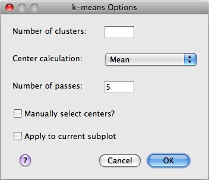

Clustering Plugins
==================
Clustering algorithms are certainly a type of analysis, but their 
importance in relation to analysis of Flow Cytometry data is such 
that they have been given their own category.

The functionality of clustering plugins is divided into two parts:

* Options dialog
* Clustering algorithm

Both parts are required, and must be returned by the registration 
function that must be included in the ``__all__`` variable. For 
clustering plugins, FIND expects the registration method to return 
a 2-tuple containing the clustering function and the options 
dialog class. For example, the ``unicluster_register`` method of the 
Unicluster plugin is::

   def unicluster_register():
         return (unicluster, UniclusterOptionsDialog)

.. note:: Only the method/class *reference* is passed, so () are omitted. 

Options Dialog
--------------
The options dialog provides a graphical interface for users 
to modify the behavior of the clustering algorithm by providing 
a set of input options. 

    
In code, the dialog is nominally a subclass of 
`wx.Dialog <http://wxpython.org/docs/api/wx.Dialog-class.html>`_, which 
provides the basic windowing functionality. However, FIND provides a 
template class (``ClusterOptionsDialog``) in the ``pluginbase.py`` module 
in the root plugins directory which is highly recommended for use as a 
superclass of the plugin options dialog. The ``ClusterOptionsDialog`` class 
already subclasses ``wx.Dialog`` and provides a set of methods that FIND 
expects when interrogating the dialog class for information. Specifically 
these are ``getMethodArgs()`` and ``getStrMethodArgs``. The first returns 
a dictionary of option/value pairs that will be passed through the ``**kwargs`` 
parameter to the clustering algorithm. The second provides an equivalency 
between the internal options variable names and string descriptions of 
the options that can be presented to the user. Further details and code 
are available in ``pluginbase.py`` and ``unicluster.py`` in the cluster folder 
of the plugins directory.

Clustering algorithm
--------------------
This method provides the multidimensional analysis for grouping the input 
data into class groupings. The function specified in the register method 
is called by FIND after the user selects the clustering plugin and provides 
input to the options dialog. The expected method signature, doc string, 
and return are::

   def clusteringMethod(data, **kwargs):
         """
         ClusteringMethod name; Description of ClusteringMethod
         
         Any additional comments
         """
         ...
         ...
         return (cluster_IDs, message)
   
The ``data`` parameter is an ``m x n`` array (numpy ``ndarray``) with 
``m`` data points (events), and ``n`` dimensions (channels). The ``**kwargs`` 
parameter is a dictionary containing the algorithm options and values specified 
by the user in the options dialog. It is in this manner that the options dialog 
is connected to the algorithm function, allowing the user to alter the algorithm 
behavior. 

The function doc string must contain on its first line, a specially crafted 
string containing the display name for the clustering method and a 
description of the method, separated by a semicolon. When importing the 
plugin, FIND will parse this first line for these two items, and incorporate 
them into the interface. Specifically, the method name will be used for the 
menu item in the Plugins menu, and the description will be displayed in the 
program status bar when the user places the mouse over the method item in 
the menu.

At the end, FIND expects a 2-tuple return containing an ``m x 1`` 
array and a ``str``. The array contains integers ``0...k`` (where ``k`` is the 
number of assigned clusters), such that each entry corresponds to the cluster 
assignment for that data point in the original input data array. The second 
part of the tuple is a string message that will be displayed to the user 
in the program status bar upon completion of the algorithm.

 
