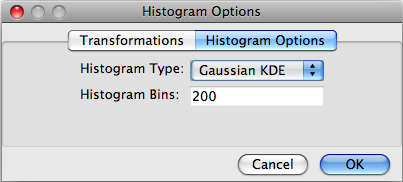
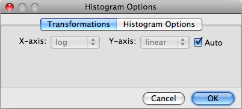

Graphing Plugins
================
Graphing plugins provide the main visual data exploration method 
for the user. All graphs/plots are fundamentally provided by the 
external library `matplotlib <http://matplotlib.sourceforge.net>`_ 
so developers should familiarize themselves with the functionality 
it provides.

The functionality of graphing plugins is divided into two parts, 
similar to the clustering plugins:

* Options dialog
* Graphing method

Both parts are required, and must be returned by the registration 
function that must be included in the ``__all__`` variable. For 
graphing plugins, FIND expects the registration method to return 
a 3-tuple containing the graphing method, the options dialog class, 
and a list containing the data item types the plugin applies to. 
Currently there are two data items: datasets and clusterings, 
represented by ``0`` and ``1`` respectively. For example, 
the ``histogram_register`` method of the Histogram 
plugin is::

   def histogram_register():
      return (histogram, HistogramOptionsDialog, [0])
      
.. note:: Only the method/class *reference* is passed, so () are omitted.
   
Here the third item of the tuple is a list containing one entry: ``0``. 
This indicates that Histogram plots are only applicable to datasets and 
not clusterings. For a graphing method that applies to both (like the 
built-in 2D Scatterplot) the list would be ``[0,1]``.

Options Dialog
--------------
The options dialog provides a graphical interface for users 
to alter the output of the graphing plugin. 

    
The FIND API provides a useful base class for creating options dialogs 
for graphing methods: OptionsDialog. This class subclasses 
`wx.Dialog <http://wxpython.org/docs/api/wx.Dialog-class.html>`_, 
and provides a `wx.Notebook <http://wxpython.org/docs/api/wx.Notebook-class.html>`_ 
control that gives the tabs seen in the figure above. The class is 
available by the following import statement::

   from plot.base import OptionsDialog
   
The base OptionsDialog class provides, in addition to the tabs, a built-in 
validation routine and template, as well as a template for loading and 
providing the options associated with the overall dialog::

   class OptionsDialog(wx.Dialog):
      def __init__(self, parent, subplot, title="Plot Options", size=(200,180)):
         wx.Dialog.__init__(self, parent, wx.ID_ANY, title, size=size)
         self.CenterOnParent()
        
         self.NB = wx.Notebook(self)
        
         # sizer for layout
         sizer = wx.BoxSizer(wx.VERTICAL)
         sizer.Add(self.NB, 1, wx.EXPAND)
         self.SetSizer(sizer)

      def cmdOK_Click(self,event):
         """
         Generic handler method for capturing the OK button click. This method
         will run the validate method for each panel in the Notebook and collect
         any error messages. If errors exist, a message dialog will be shown 
         and the options dialog will be prevented from confirming until the 
         errors are fixed. Otherwise, the event will be bubbled up as normal.
         """
         msg = []
         for i in range(self.NB.PageCount):
            msg.extend(self.NB.GetPage(i).validate())
        
         # Display any error messages
         if len(msg) > 0:
             dlg = wx.MessageDialog(None, '\n'.join(msg), 
                                   'Invalid input', wx.OK | wx.ICON_ERROR)
             dlg.ShowModal()
             dlg.Destroy()
             return
             
         event.Skip()

      def loadOptions(self, opts):
         """
         Loads saved options into all notebook pages via the loadOptions() 
         method that must exist in each.
        
         Unless specific functionality is needed, subclasses of OptionsDialog
         should not need to override this method.
        
         :@type opts: dict
         :@param opts: The saved plot options.
         """
         for i in range(self.NB.PageCount):
            self.NB.GetPage(i).loadOptions(opts)

      @property
      def Options(self):
         """
         The Options property will retrieve all settings from each notebook page in self.NB
        
         Unless specific functionality is needed, subclasses of OptionsDialog
         should not need to override this property.
        
         :@rtype: dict
         :@return: The specified plot options.
         """
         options = {}
         for i in range(self.NB.PageCount):
            options.update(self.NB.GetPage(i).Options)
        
         return options
         
In this class, the ``loadOptions`` method and the ``Options`` property 
are run automatically and do not need to be overridden by subclasses. 
The ``cmdOK_Click`` method is available for automatic validation, if 
desired. However, if you want to include custom code in the click 
event method for the OK button on the Dialog, you must implement 
your own. However, you can still make use of the validation code 
by calling the ``cmdOK_Click`` from the superclass once your custom 
event code is completed.

Separate groupings of options are placed in tabs, and some general sets of 
options are provided by the FIND API.

For example, the Transformations options (as seen in the figure above) can be 
accessed by the following import statement::

   from plot.base import TransformOptionsPanel
   
Developers can provide their own option panels that can be included as 
a tab in the dialog by subclassing from the ``OptionsPanel`` class, also 
available in the ``plot.base`` module.::

   class OptionsDialogPanel(wx.Panel):
      def loadOptions(self, opts):
         pass
     
      def validate(self):
         pass
    
      @property
      def Options(self):
         pass
         
Each of these methods must be overridden for each panel that subclasses 
from ``OptionsDialogPanel``. The ``loadOptions`` method simply takes 
the ``opts`` dictionary and copies the panel-specific options from it 
into the panel controls. The ``validate`` method builds a list of 
strings containing error messages, one list item per validation error. 
These lists are gathered from each options panel, concatenated, and 
displayed to the user after clicking the OK button, and control is returned 
to the user for them to correct the errors. If none of the panels report 
errors, program execution continues to the graphing method. The ``Options`` 
property is the opposite of the ``loadOptions`` method; it builds a dictionary 
of option/value pairs from the controls on the panel. Each panel contributes 
its own options dictionary to a larger one that is finally passed to the
graphing method for use.
 
The other built-in, generic options panels are::

   RangeOptionsPanel, SingleTransformOptionsPanel
   
The RangeOptionsPanel allows users to specify range in the X and Y axes. 
The SingleTransformOptionsPanel is identical to the TransformOptionsPanel, 
except it provides a single transformation for the whole plot (instead of 
by axis). Below is a list of the options each of the previously mentioned 
options panels provides::

   RangeOptionsPanel: 'xRange', 'yRange', 'xRangeAuto', 'yRangeAuto'
   TransformOptionsPanel: 'xTransform', 'yTransform', 'transformAuto'
   SingleTransformOptionsPanel: 'transform', 'transformAuto'
   
For the ``RangeOptionsPanel``, xRange and yRange are tuples containing floats. 
The other two options are booleans indicating whether the user wants the 
respective range options chosen automatically by the graphing method. For 
the ``TransformOptionsPanel``, the x and y transform options are strings 
indicating the type of transform method that should be applied to the data 
before graphing. Currently the only available options are ``linear`` and ``log``. 
Linear amounts to not applying any transform to the data. The ``log`` transform 
can be applied by the particular matplotlib plot (if available), or using the 
FIND Transforms API, which will be discussed later in the section on Graphing 
Methods.

Graphing Methods
----------------
The second part of any Graphing plugin is the actual graph/plotting method that 
causes the underlying matplotlib library to draw to the plot Panel in the FIND 
user interface. The expected method signature and doc string are as follows::

   def graphingMethod(subplot, dims):
      """
      method-string-ID; method-name; Method description string
      """

The two parameters above are always passed to the graphing method, but do not 
necessarily need to be each used. The ``dims`` parameter is simply a list 
containing the currently selected data dimensions. The ``subplot`` parameter is 
a ``Subplot`` class instance. This class is the basic unit that represents a 
single graph/plot in the plot Panel in the UI. It contains the following
attributes (lower case) and properties (capitalized) of use to plugin authors::

   Subplot:
      Data
      Clustering
      opts
      axes
      parent

The ``Data`` and ``Clustering`` properties, respectively, provide the data array 
and (optionally) the array of cluster assignments. As stated previously, 
graphing methods must specify whether they apply to datasets, clusterings, or 
both. Thus, you only need to use what you specify as the target items. The 
``opts`` attribute is a dictionary collected from the options dialog provided 
with the graphing method.

   .. important:: Since the options dialog is only available to the user once 
      the plot has been drawn, the ``opts`` attribute is empty the first 
      time the graphing method is called. Thus, each graphing plugin must 
      check whether the ``opts`` dict is empty and fill it with default
      options.

The ``axes`` attribute is an instance of the matplotlib 
`Axes <http://matplotlib.sourceforge.net/api/axes_api.html>`_ class. This 
class is the target for drawing, and all matplotlib provided plotting 
methods are available through it. The final ``parent`` attribute is an 
instance of the matplotlib 
`Figure <http://matplotlib.sourceforge.net/api/figure_api.html>`_ class. This 
class represents the entire drawing area in the UI, and is necessary for 
some applications such as providing scale bars and legends on plots (see 
the Heatmap2D plugin for an example).

As mentioned above, you may want to include data transformation options 
in your plugin. Currently the built-in options panel is not linked to the 
Transform methods module, and only allows for ``linear`` and ``log`` options. 
However, if you want to perform a log transformation before plotting 
(instead of asking matplotlib to do it as part of the plot), you can 
access the Transforms module with the following import::

   import transforms.methods as tm
   
This module provides a ``getMethod(strID)`` method that returns the method 
specified by the string identifier of the transformation method/plugin. 
So to apply a log transform to your data with the built-in log method 
you might use the following line::

   logData = tm.getMethod('log')(data)

The graphing method is not expected to return anything since the 
entire aim is to issue drawing commands to the underlying matplotlib engine.

Returning to the method declaration, the first line of the doc string must 
be semicolon-separated into three fields as seen above. The 'string-ID' 
field is what other plugin authors will give to the internal plot module in 
order to access the graphing method from within their own code. For example, 
an analysis plugin may want to display results in a temporary window that
provides a simple Figure canvas. The 'method-name' is a short name that FIND 
will use for the menu item placed in Plugins>>Graph as well as the context 
plot menu that appears when clicking on a data item in the project tree. The 
final field will appear in the program status bar when a user moves the 
mouse over the menu item for the graphing plugin.

