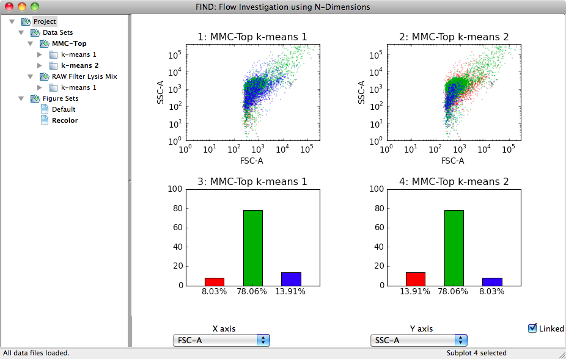

Data Analysis
================================
Moving from analysis using traditional gating techniques to automated and semi-
automated methods such as are provided in FIND can be a difficult shift due to 
the degree of control you give up over how the data is divided into separate 
clusters or segments. This section will provide an overview of the methods FIND 
provides for analysis, how to use them, and suggestions on how to proceed given 
those tools.

Clustering
----------
Clustering or machine learning describes the process of mathematical analysis 
of the given data in order to determine groupings of data points (events) that 
are more similar to each other than to those not in the group. These algorithms 
are split into two categories based on how they work:

1. `Supervised <http://en.wikipedia.org/wiki/Supervised_learning>`_ - Generally 
   require some sort of "training" data where the classification (group) of 
   each point is known ahead of time so the algorithm can use that data to 
   "learn" and be able to predict future datasets.

2. `Unsupervised <http://en.wikipedia.org/wiki/Unsupervised_learning>`_ - 
   Requires no foreknowledge of any kind. Simply attempts to classify data 
   based on mathematical relationships (such as distance) between the input 
   data points.

Clustering with FIND
^^^^^^^^^^^^^^^^^^^^
FIND currently provides two unsupervised clustering methods: 
`k-means <http://en.wikipedia.org/wiki/K_means>`_ and a modified k-means 
specifically designed for Flow Cytometry data as published by 
`T. Bakker Schut et al.  <http://onlinelibrary.wiley.com/doi/10.1002/cyto.990140609/abstract>`_ 
in *Cytometry Part A*.

All built-in clustering algorithms are available through the **Cluster** menu. 
Plugin clustering algorithms are available in the **Plugins>>Cluster** menu. 
When you choose an algorithm from the menu, it operates only on the currently 
selected dataset (bold in the Data Sets subtree; see Introduction section on 
the User Interface). So make sure the dataset you want to analyze is selected 
before you run a clustering. When the clustering is completed, a new entry is 
added as a child of the dataset in the Project tree. The default name is the 
name of the clustering method and an auto-incremented integer (e.g. k-means 1). 
Currently you cannot change the name of a clustering entry. Each clustering 
appears with an expand arrow next to it. Clicking on the arrow will show a text 
entry underneath the clustering with a list of the options and the values you 
provided to run that particular clustering instance. This can be useful if you 
cluster run multiple clusterings, either on the same dataset or different ones, 
to make sure you used the same settings.

.. note:: Many clustering methods use random number generation to perform 
         certain aspects of the algorithm such as choosing the initial cluster 
         centers in k-means. This tends not to greatly affect the final 
         results and, for example, in k-means, the user can specify that the 
         algorithm be run multiple times to reduce any potential effect. 
         Ultimately, just be aware that you may not get the *exact* same 
         results running the same algorithm twice, but there should be no 
         significant difference between runs.  

The basic requirement for many unsupervised clustering methods is that you 
provide the number of desired clusters or groups you want the data to be 
partitioned into. If your data is fairly well separated/distinguished between 
different cell types, you may want to enter the number of different types you 
expect. Often, however, it can be helpful to request a larger number of 
clusters than cell types that you expect. This can give you a finer 
understanding of the layout of the data, to which you can apply your domain 
knowledge to throw away, keep, or combine into larger groups (this tool will be 
described later) the initially found clusters.

K-Means Clustering
^^^^^^^^^^^^^^^^^^
For a description of the operation of the basic k-means algorithm, please 
see the excellent `Wikipedia <http://en.wikipedia.org/wiki/K-means_clustering>`_ 
article. Note that while this algorithm was not designed specifically for Flow 
Cytometry data, it has been successfully applied to such data (citation). 

Below is the options dialog that appears when you select the 
**Cluster>>k-means** menu item.  

.. figure:: figures/da_fig1_kmeans_opts.png
   :scale: 60 %

* **Number of clusters** - The number of clusters that should be found as the final 
  result of the algorithm

* **Center calculation** - The mathematical measure the algorithm should use when 
  determining the cluster center from its members.

* **Number of passes** - The algorithm is re-run a number of times specified by 
  this parameter, each time a new set of initial cluster centers are chosen. 
  The results of each run are compared to find the best.

* **Manually select centers** - This option allows the user to (in a separate 
  window that pops up) to choose the initial centers of the clusters by 
  clicking within the data space in any set of 2 dimensions. Choosing this 
  parameter will remove the need to specify the number of target clusters as 
  well as the option to re-run multiple times. Consequently, those options are 
  disabled when this option is checked.

* **Apply to current subplot** - Upon completion of the clustering, the result will 
  be displayed as a colored scatterplot, replacing the currently selected plot.
  
.. note: This information on the algorithm options is available in-program by 
         clicking on the help button in the options dialog box.

Bakker Schut K-Means Clustering
^^^^^^^^^^^^^^^^^^^^^^^^^^^^^^^
As mentioned earlier, this algorithm was implemented from the description 
provided in the publication by 
`T. Bakker Schut et al. <http://onlinelibrary.wiley.com/doi/10.1002/cyto.990140609/abstract>`_ 
in *Cytometry Part A*.

.. figure:: figures/da_fig2_bs-kmeans_opts.png
   :scale: 60 %

* **Number of final clusters** - The number of clusters that should be found as 
  the final result of the algorithm.

* **Number of starting clusters** - The algorithm begins by selecting a large 
  number of clusters (200 by default) and iteratively merging those closest 
  together until the specified target number of clusters is acheived. This 
  number affects performance, so if the clustering is running too slowly, 
  decreasing this parameter will help.

* **Apply to current subplot** - Upon completion of the clustering, the result will 
  be displayed as a colored scatterplot, replacing the currently selected plot.

.. note: This information on the algorithm options is available in-program by 
         clicking on the help button in the options dialog box.

Interacting with Clusterings
----------------------------
After running a clustering algorithm on a dataset, FIND provides a number of 
means to analyze and interact with the clustering. The most basic is 
visualization of the clustering; these options are discussed in the previous 
section of this manual. Other options are provided through the **Data** menu 
and the context menu available by right-clicking on the clustering item in the 
Project tree; these options are discussed below.

Clustering Information
^^^^^^^^^^^^^^^^^^^^^^
The first option available, after plots, in the context menu for clusterings is 
the **Info** item. Selecting this option provides a dialog indicating, for each 
cluster: the color, the percentage of events belonging to that cluster out of 
the whole for the parent dataset, and the total number of events the percentage 
translates into.

Isolating Clusters
^^^^^^^^^^^^^^^^^^
The next available option through the context menu is **Isolate Clusters**. 
This incredibly useful tool allows you to create an entirely new dataset by 
choosing one or more clusters from the selected clustering. This is 
accomplished through the dialog show below: 

This dialog is essentially identical to the clustering information dialog, with 
the added column of checkboxes. Selecting one or more checkboxes will create a 
new dataset with the selected clusters joined together. Once you select the 
cluster(s) you want, clicking the OK button will bring up a simple dialog box 
asking you to give a name to the new dataset. When you type in a name and click 
OK again, the new dataset will appear as a child in the tree of the dataset it 
was created from (parent dataset).

.. note:: As mentioned in the Data section, datasets which represent isolated 
          clusters can be exported as external files to disk, allowing 
          visualization and analysis of clusters in other programs.

Recoloring Clusterings
^^^^^^^^^^^^^^^^^^^^^^
As discussed earlier, there is some randomness in certain clustering algorithms. 
For example, the initial cluster centers may be chosen randomly. These centers 
move around as the algorithm progresses, but their order determines the color 
the cluster is represented by. Thus, even if two runs of the same algorithm 
produce the same clusters for a dataset, the order they are presented in may be 
different. The results are identical, but they are presented to the user in 
different colors, making it more difficult to do comparative analysis. The 
**Data>>Recolor Clusters** menu action provides a means to fix this problem. 

.. figure:: figures/da_fig5_recolor_dlg.png
   :scale: 60 %

In the dialog shown above, select the two clusterings you are interested in. 
FIND then compares each of the clusters between the two selected items to 
determine the cluster pairs that are most similar. The clusters are then 
reordered such that those most similar have the same color. The following two 
images illustrate this exact point. Two clusterings of the same data produce 
three clusters with the exact same percentage breakdown, but the blue and red 
clusters appear to be switched. After recoloring, in the second image, the 
clusters are ordered correctly as can be seen in both sets of graphs.

   

 

