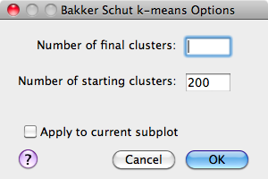

Data Analysis
================================
Moving from analysis using traditional gating techniques to automated and semi-
automated methods such as are provided in FIND can be a difficult shift due to 
the degree of control you give up over how the data is divided into separate 
clusters or segments. This section will provide an overview of the methods FIND 
provides for analysis, how to use them, and suggestions on how to proceed given 
those tools.

Clustering
----------
Clustering or machine learning describes the process of mathematical analysis 
of the given data in order to determine groupings of data points (events) that 
are more similar to each other than to those not in the group. These algorithms 
are split into two categories based on how they work:

1. `Supervised <http://en.wikipedia.org/wiki/Supervised_learning>`_ - Generally 
   require some sort of "training" data where the classification (group) of 
   each point is known ahead of time so the algorithm can use that data to 
   "learn" and be able to predict future datasets.

2. `Unsupervised <http://en.wikipedia.org/wiki/Unsupervised_learning>`_ - 
   Requires no foreknowledge of any kind. Simply attempts to classify data 
   based on mathematical relationships (such as distance) between the input 
   data points.
   
FIND currently provides two unsupervised clustering methods: 
`k-means <http://en.wikipedia.org/wiki/K_means>`_ and a modified k-means 
specifically designed for Flow Cytometry data as published by 
`T. Bakker Schut et al.  <http://onlinelibrary.wiley.com/doi/10.1002/cyto.990140609/abstract>`_ 
in *Cytometry Part A*.

K-Means Clustering
^^^^^^^^^^^^^^^^^^
For a description of the operation of the basic k-means algorithm, please 
see the excellent `Wikipedia <http://en.wikipedia.org/wiki/K-means_clustering>`_ 
article. Note that while this algorithm was not designed specifically for Flow 
Cytometry data, it has been successfully applied to such data (citation). 

The basic requirement for k-means is that you provide the number of desired 
clusters or groups you want the data to be partitioned into. If your data is 
fairly well separated/distinguished between different cell types, you may want 
to enter the number of different types you expect. Often, however, it can be 
helpful to request a larger number of clusters than cell types that you expect. 
This can give you a finer understanding of the layout of the data, to which you 
can apply your domain knowledge to throw away, keep, or combine into larger 
groups (this tool will be described later) the initially found clusters.

Below is the options dialog that appears when you select the 
**Cluster>>k-means** menu item.  

* **Number of clusters** - The number of clusters that should be found as the final 
  result of the algorithm

* **Center calculation** - The mathematical measure the algorithm should use when 
  determining the cluster center from its members.

* **Number of passes** - The algorithm is re-run a number of times specified by 
  this parameter, each time a new set of initial cluster centers are chosen. 
  The results of each run are compared to find the best.

* **Manually select centers** - This option allows the user to (in a separate 
  window that pops up) to choose the initial centers of the clusters by 
  clicking within the data space in any set of 2 dimensions. Choosing this 
  parameter will remove the need to specify the number of target clusters as 
  well as the option to re-run multiple times. Consequently, those options are 
  disabled when this option is checked.

* **Apply to current subplot** - Upon completion of the clustering, the result will 
  be displayed as a colored scatterplot, replacing the currently selected plot.
  
.. note: This information on the algorithm options is available in-program by 
         clicking on the help button in the options dialog box.

Bakker Schut K-Means Clustering
^^^^^^^^^^^^^^^^^^^^^^^^^^^^^^^
As mentioned earlier, this algorithm was implemented from the description 
provided in the publication by 
`T. Bakker Schut et al. <http://onlinelibrary.wiley.com/doi/10.1002/cyto.990140609/abstract>`_ 
in *Cytometry Part A*.

* **Number of final clusters** - The number of clusters that should be found as 
  the final result of the algorithm.

* **Number of starting clusters** - The algorithm begins by selecting a large 
  number of clusters (200 by default) and iteratively merging those closest 
  together until the specified target number of clusters is acheived. This 
  number affects performance, so if the clustering is running too slowly, 
  decreasing this parameter will help.

* **Apply to current subplot** - Upon completion of the clustering, the result will 
  be displayed as a colored scatterplot, replacing the currently selected plot.

.. note: This information on the algorithm options is available in-program by 
         clicking on the help button in the options dialog box.

Interacting with Clusterings
----------------------------

