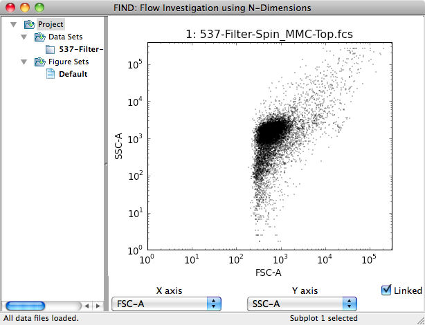

Data
=====
Currently, the main source FIND accepts for data are 
`FCS 3.0 <http://www.isac-net.org/index.php?option=com_content&task=view&id=101&Itemid=150>`_
formatted data files. These files contain a great deal of useful information 
that FIND can make use of to provide a better user experience. However, FIND can 
also open CSV (comma separated value) files in the following format::

	"FSC-A","SSC-A","PI (live-dead)-A","GFP-A"
	389.850006103516,2.46000003814697,-14.7600002288818,1739.21997070312
	.
	.
	.
	
Additional file formats may be used as a source if a 
`plugin <http://www.justicelab.org/find/plugins>`_ is available to handle them.

Opening files
--------------
Flow Cytometry (FC) data files are opened through the File >> Open... menu item 
in the FIND interface. As mentioned in the previous section, the main data 
source are FCS 3.0 files, and those are enabled for selection by default. The 
screenshots below illustrate the process of opening single or multiple files. 

Open File dialog with FCS 3.0 selected by default

       
After choosing your file(s) the Sample Data Display window appears with all the 
channels and the first ten rows of data visible. The data grid allows you to 
rearrange columns by clicking on the column header and dragging to the desired 
position. Double clicking on the column header allows you to rename the channel, 
as illustrated above. If you are opening multiple files with the same column 
order, check the 'Apply to all files' option. This will apply the column order 
and names to all following files.

.. note:: When opening multiple files, FIND assumes each experiment represented 
          by the files was done with the same channels, and will use the channel 
          names from the first opened file to populate the Dimension Selection 
          dropdowns.  
    
.. figure:: figures/data_fig3_seldims.png
   :scale: 60 %
       
The second dialog displayed when opening FC data files allows you to specify 
which channels are used when applying automated analysis tools such as 
clustering algorithms. For example, in many cases the automatically recorded 
Time channel does not provide useful information for classifying cells. In the 
screenshot above, it has been deselected. Again, by selecting 'Apply to all 
files' the selections made here will automatically be applied to the rest of 
the files being opened.

The two screenshots below illustrate the result of opening, respectively, one 
and multiple files. FIND automatically plots a 2D scatter plot of the first two 
channels for each opened file. For multiple files, the plots are arranged in 
an ``n x 2`` (rows, columns) format where ``n`` is half the number of 
opened files.

   

   
 
Exporting Data
--------------
Through the File>>Export... submenu you can save the currently selected data 
item to file. The specific export type is selected directly as an option in the 
submenu. FIND currently has the ability to export to CSV, but any IO plugin 
may implement an export file type.

.. note:: This can be coupled with the Isolate Clusters tool (see Data 
          Analysis section) to export clusters to external files in order to 
          perform analysis and/or visualization with other programs.

Saving and Restoring the Project
--------------------------------
FIND allows you to save the entire state of the analysis as two files:
one containing all the qualitative information about data structure, 
attributes, and visualizations, the second a simple binary file containing all 
the loaded numeric data. These two files can be packaged and transported in any 
manner for later use on the same machine or any other machine running
FIND. To save your project, use the **File>>Save Project...** menu action 
(Ctrl-S on Windows or Command-S on OS X). The file you specify will be saved as a 
**.find** file and a **.npz** file. To load a previously saved project, use the 
**File>>Load Project** menu action (Ctrl-L on Windows or Command-L on OS X) and 
select the **.find** file of the project you want. Everything will be restored 
as it was when the project was saved. 

