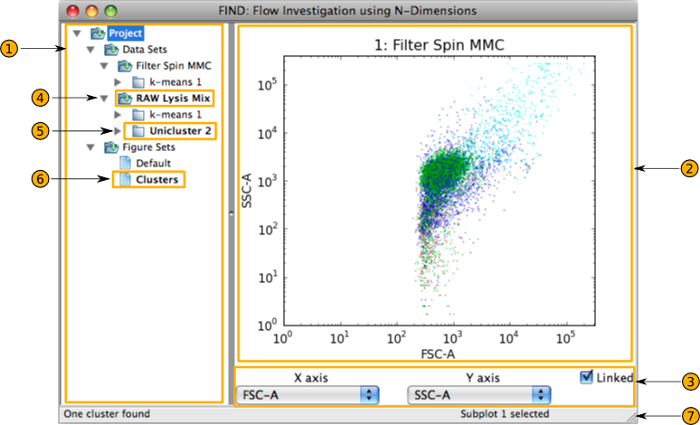

Introduction
============
The FIND software platform is designed to be a user-friendly tool for analysis 
and visualization of Flow Cytometry data, revolving around automated methods 
based on multi-dimensional mathematical inspection of relationships between 
sampled cells and their recorded fluorescence emissions.

FIND is also designed to be a platform for development and distribution of 
new analysis and visualization methods, simplifying the process of finding and 
using new research in Flow Cytometry analysis. If you are interested in 
developing plugins for FIND, please visit the developer documentation on the 
main documentation page (link at the top left).

The main website for FIND is located at:

`http://www.justicelab.org/find <http://www.justicelab.org/find>`_

The current version (as indicated at the top of the page) of FIND is available 
there for download, as well as any plugins. For help and questions that are not 
addressed here, support forums exist at FIND's 
`Sourceforge project page <http://sourceforge.net/projects/fc-find/support>`_.   

User Interface
--------------
Below is a screenshot of the basic user interface for FIND. The major interface 
elements are highlighted, as well as the important data FIND keeps track of 
at all times.

   
1. **Project Tree** - This is a hierarchical representation of the loaded 
   datasets and their clusterings (where existing), and the list of stored 
   Figure Sets (see Visualization section). Much of the user interaction with 
   these items occurs from within this tree through the context menus of 
   individual items. This tree also provides visual clues to help the user 
   identify the current selection for various items. These current selections, 
   as discussed in detail below, help guide user interaction as many menu 
   actions operate on them.

2. **Plotting Area** - This rectangular area contains all the graphs and 
   visualizations. It is divided into a grid layout (rows and columns) that 
   can be set by the user (menu **Plots>>Setup**). Everything contained within this 
   area is stored in the Figure it belongs to, and selecting a different Figure 
   from the list of Figure Sets in the Project Tree will replace the contents 
   of the Plotting Area with the plots stored in the newly selected Figure.

3. **Channel Selection Panel** - The dropdown boxes in this panel contain the 
   channels (dimensions) within the loaded datasets. The selected channel, as 
   reflected by the display within the box, controls the displayed channels in 
   the plots that display single channels (2D Scatterplot, Histogram, etc...). 
   When a channel is changed in one of the selectors, every plot that is 
   affected is updated and redrawn, thus each of these are "linked" to the 
   channel values in the selection boxes. If you want to "freeze" individual 
   plots such that they do not respond to channel selection changes, simply 
   click on the plot, and uncheck the box next to the "Linked" label on the 
   right side of the panel. 

4. **Currently Selected Dataset** - For all the loaded datasets, there is a 
   single dataset that is considered the "selected" dataset. FIND uses this 
   selection to determine which dataset to operate on when the user selects 
   menu actions such as clustering algorithms or various plugins. Visually, 
   as can be seen in the above image, this dataset is distinguished by a bold 
   font.

5. **Currently Selected Clustering** - This operates in a similar fashion to 
   the selected dataset. Currently it is only important when adding a new plot 
   to the Plotting Area (**Plots>>Add New Subplot**). If the current 
   dataset also has one or more clusterings, the selected clustering will be 
   plotted as a colored 2D Scatterplot (indicating different clusters) when 
   the new plot is created. As with the selected dataset, the selected 
   clustering is indicated by a bold font.

6. **Currently Selected Figure** - This selection (also in bold font) indicates 
   the Figure that is currently active and displayed in the Plotting Area. To 
   switch the displayed Figure, you can simply click on the Figure you want 
   displayed and FIND will automatically switch out the old Figure for the new 
   Figure. Note that the current Figure cannot be deleted, so you must switch 
   to a different Figure, then right-click on the Figure you want to delete, 
   and select **Delete** from the context menu. 

7. **FIND Status Bar** - The status bar is divided into two regions. The region 
   on the right is used to display messages to the user based on actions they 
   have performed, or short explanations of menu items the mouse is hovering 
   over. The left side of the bar is used to indicate the final Selected Item 
   that FIND keeps track of: the Currently Selected Plot. The selection is made 
   by left-clicking on an individual plot (subplot) within the Plotting Area. 
   This allows FIND to determine where new plots should be drawn to when plotting a 
   dataset or clustering through the context menu for those items.

Updating FIND
-------------
You can check for updates to FIND through the **Help** menu. If an update is 
available, FIND will notify you and offer to open the website so you can 
download the newest version.

