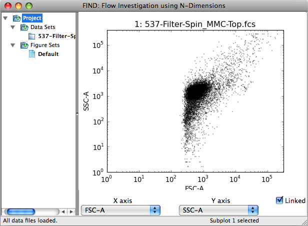
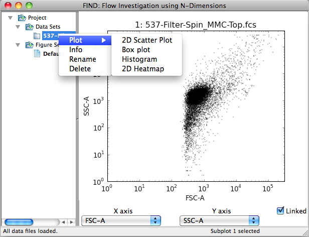
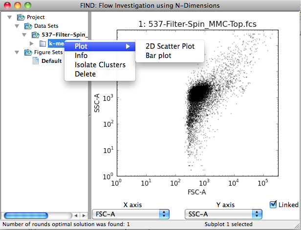
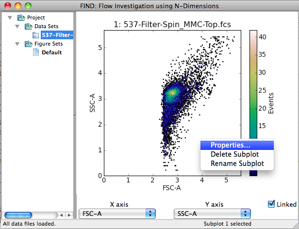
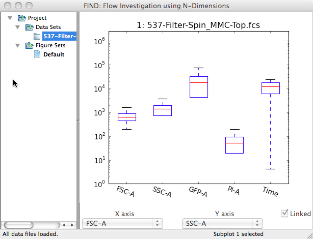
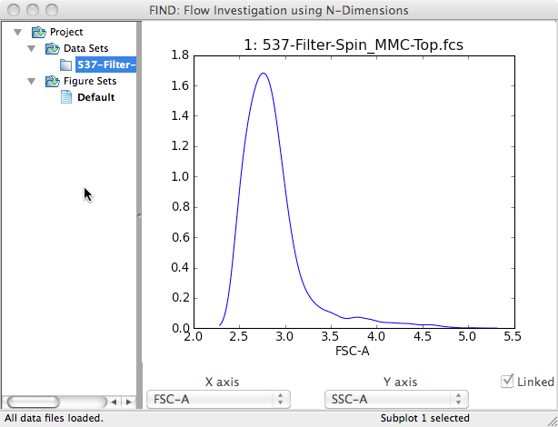
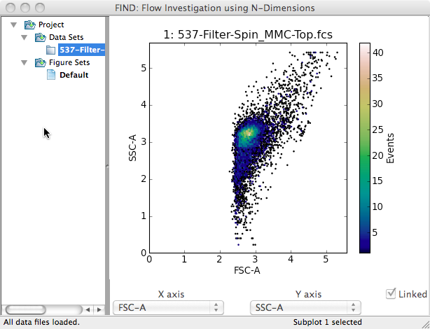

Visualization
=============
Data visualization in FIND is performed mainly through the plotting area,  
which makes up the right side of the main program window.

   
Here single data file has been opened, and a single 2D scatter plot 
automatically created, visualizing the first two dimensions of the data as 
given by the file. If multiple files had been opened, the plotting area would 
be automatically divided into ``n x 2`` (rows x columns), where ``n`` is half 
the number of opened files. The plots contained within the plotting area are 
collectively referred to as a Figure, which will be explained in detail later.

Plots are created by accessing the Plot context menu available by 
right-clicking (or ctrl-click on OS X)

   

   
The above images illustrate the subdivision of plot types. Specifically, plots 
are grouped into those applicable to datasets and those applicable to 
clusterings.

.. note:: Plot types applicable to both data items show up in the context menus 
          for both (e.g. 2D Scatter Plot).

Altering Plots
--------------
The main method of interacting with and changing the view of a plot is through 
the Dimension Selection panel beneath the plotting area. This panel contains 
two dropdown boxes labeled ``X axis`` and ``Y axis`` (when 3D plots are added 
a third for the Z axis will be added). Changing the selected dimension 
automatically updates all the plots in the plotting area, with some exceptions. 
Specifically, those plot types that display all dimensions at once, or are 
otherwise not designed to change will not be updated. Additionally, individual 
plots can be 'unlinked' from the selection panel. This involves first selecting 
a plot by clicking on it (within the area it is drawn to). The selection is 
confirmed by a change in the status bar at the bottom of the main window, 
indicating **Subplot n selected**. Next, deselecting the checkbox marked 
**Linked** causes the plot to be frozen as is with respect to the selection 
of dimensions. For example, a series of plots (Figure) could be created 
displaying all possible 2D plots of a dataset by creating one plot for each 
possibility, and progressively unlinking and changing dimensions for each.

The second method of changing the display of an individual plot is through 
changing the plot settings, accessible through the context menu when 
right-clicking on a plot.

   
Selecting the **Properties...** menu item displays a settings dialog allowing 
you to alter the display or calculation with options specific to the plot type 
or general. Examples of each and more information are discussed in the 
following sections.

Dataset Plots
-------------
FIND currently provides four plot types for visualizing datasets: 2D Scatter 
Plot, Box Plot, Histogram, and 2D Heatmap. Each of these plots are explained 
in the following sections.

2D Scatter Plot
^^^^^^^^^^^^^^^
The 2D Scatter Plot draws a single point in two dimensional space for each 
event (cell) in the dataset.  

Boxplot
^^^^^^^

Histogram
^^^^^^^^^

2D Heatmap
^^^^^^^^^^

   
   
   
   
   
   
   
   
   
   
   
   
   