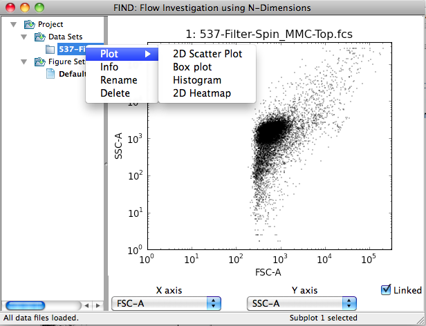
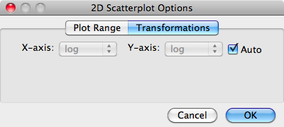
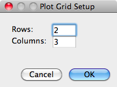

Visualization
=============
Data visualization in FIND is performed mainly through the plotting area,  
which makes up the right side of the main program window.

.. figure:: figures/data_fig4_fileopened.png
   :scale: 30 %
   
Here single data file has been opened, and a single 2D scatter plot 
automatically created, visualizing the first two dimensions of the data as 
given by the file. If multiple files had been opened, the plotting area would 
be automatically divided into ``n x 2`` (rows x columns), where ``n`` is half 
the number of opened files. The plots contained within the plotting area are 
collectively referred to as a Figure, which will be explained in detail later.

Plotting Data
--------------
First select the plot (also called subplot) you want by clicking on it. Your 
choice is reflected in the far right section of the status bar (see images 
below). A new plot can be created in the selected plot space by accessing 
the **Plot** context menu available by right-clicking (or ctrl-click on OS X 
for single-button mice).

   
.. figure:: figures/viz_fig3_cluster_plots.png
   :scale: 30 %
   
The above images illustrate the subdivision of plot types. Specifically, plots 
are grouped into those applicable to datasets and those applicable to 
clusterings.

.. note:: Plot types applicable to both data items show up in the context menus 
          for both (e.g. 2D Scatter Plot). 

Adding and Deleting Plots
---------------------------
A new plot space can be added by selecting the **Plots>>Add Subplot** menu 
item. The new space is automatically selected as the current and so is ready 
to be drawn to.

A plot (and its space) can be deleted through the context menu (right-click) 
for that specific plot.

Altering Plots
--------------
The main method of interacting with and changing the view of a plot is through 
the Channel Selection panel beneath the plotting area. This panel contains 
two dropdown boxes labeled ``X axis`` and ``Y axis`` (when 3D plots are added 
a third for the Z axis will be added). Changing the selected channel (dimension) 
automatically updates all the plots in the plotting area, with some exceptions. 
Specifically, those plot types that display all dimensions at once, or are 
otherwise not designed to change will not be updated. Additionally, individual 
plots can be 'unlinked' from the selection panel. This involves first selecting 
a plot by clicking on it (within the area it is drawn to). The selection is 
confirmed by a change in the status bar at the bottom of the main window, 
indicating **Subplot n selected**. Next, deselecting the checkbox marked 
**Linked** causes the plot to be frozen as is with respect to the selection 
of dimensions. For example, a series of plots (Figure) could be created 
displaying all possible 2D plots of a dataset by creating one plot for each 
possibility, and progressively unlinking and changing dimensions for each.

The second method of changing the display of an individual plot is through 
changing the plot settings, accessible through the context menu when 
right-clicking on a plot.

.. figure:: figures/viz_fig4_plot_context.png
   :scale: 30 %
   
Selecting the **Properties...** menu item displays a settings dialog allowing 
you to alter the display or calculation with options specific to the plot type 
or general. Examples of each and more information are discussed in the 
following sections.

General Plot Properties
^^^^^^^^^^^^^^^^^^^^^^^
FIND provides two sets of general plot options that appear where appropriate 
(and available to plugin authors). First, below, is the Plot Range options 
panel. Here you can modify the graph window within which the data is displayed. 
By default, FIND plots on both axes, a range from 0 to the maximum value of the 
data plus five percent, i.e. ``(0, max(data) * 1.05]``. This is indicated by the 
selection of the **Auto** checkboxes.

The second set of general options is the Transformations panel. This setting is 
initially set automatically by inspection of the data. FCS format files list 
the amplification type (linear or logarithmic) used to capture each channel 
of data, and FIND uses this information to decide whether the data should be 
displayed in a linear or log\ :sub:`10` \ scale. In this options panel, you can tell 
FIND to either use automatically discovered information, or choose what scale 
the data are displayed in for each axis independently.

Dataset Plots
-------------
FIND currently provides four plot types for visualizing datasets: 2D Scatter 
Plot, Box Plot, Histogram, and 2D Heatmap. Each of these plots are explained 
in the following sections.

2D Scatter Plot
^^^^^^^^^^^^^^^
The 2D Scatter Plot draws a single point in two dimensional space for each 
event (cell) in the dataset. Below is an example plot of the Forward Scatter 
(x-axis) and Side Scatter (y-axis) on a log\ :sub:`10` \ scale. As seen in the 
General Plot Properties section above, there are no options particular to the 
2D Scatter Plot.

.. figure:: figures/data_fig4_fileopened.png
   :scale: 30 %

Boxplot
^^^^^^^
The Boxplot visualization is an example of a plot that is insensitive to 
user changes to the displayed channel, as it displays data for all channels 
at once. The x-axis here displays one tick-mark for each channel in the data, 
and for each channel a traditional 
`box plot <http://en.wikipedia.org/wiki/Box_plot>`_ in the y-axis.

.. figure:: figures/viz_fig7_boxplot.png
   :scale: 30 %
   
The only alterable properties for this plot (as seen below) is the angle to 
which the x-axis labels are rotated, with ``0`` representing a horizontal 
orientation. This is useful for datasets with many channels where FIND does not 
adequately choose an angle that cleanly separates the labels.

Histogram
^^^^^^^^^
The Histogram plot displays a single channel (x-axis) and, by default fits a 
Gaussian kernel to the data as an approximation to get the smooth curve seen 
in the image below. 

The Gaussian kernel estimation gives a good representation of the overall 
shape of the data, but may not adequately estimate the amplitude. In the 
options for this plot, you can additionally select to display the histogram as 
a traditional binned plot separately, or overlay the estimation with the binned 
version via the **Histogram Type** option. Finally, you can set the fineness of 
the plot by changing the **Histogram Bins** option.  
   

2D Heatmap
^^^^^^^^^^
The heatmap plot is essentially a 2D histogram. It divides the plot into a set 
of hexagonal bins, only displaying a bin if it contains at least one data 
point. The density of points contained within the bin is displayed as a color 
map (heat map) with a scale bar on the right side of the plot.

   
There are three (currently two) modifiable options for the 2D Heatmap. The 
**Heatmap Type** is currently under development and other options will 
eventually be available. The **Color Map** option sets the range of colors that 
are mapped to bin density from low to high. The default gist_earth (seen in the 
above image) is generally good, but other color maps may provide better 
visualization for sparse or especially dense datasets. The **Bins** option 
specifies the fineness of the 2D subdivision of the data points. Larger 
values may provide better insight into the data, but will take longer to 
plot.

   
Clustering Plots
----------------
FIND currently provides two plot types for visualizing clustering results: 2D 
Scatter Plot and Barplot.

2D Scatter Plot
^^^^^^^^^^^^^^^
The only difference between the the 2D Scatter Plot as applied to a clustering 
as opposed to a dataset, is color. Each data point is colored according to 
cluster membership as seen in the image below. There are no plot-specific 
options.

Barplot
^^^^^^^
This plot displays cluster membership counts in a vertical bar along the 
y-axis. Each cluster is a tick on the x-axis. The default y-axis value is the 
percentage of each cluster out of the total events in the parent dataset.

The Barplot comes with two plot-specific options. The first option allows you 
to change the rotation angle of the x-axis labels (similar to the Barplot). The 
**View** option changes the meaning of the y-axis values: the default 
percentage (as mentioned above), the percentage of the top level parent, and 
the total number of events in each cluster (no percentage).

.. note:: As will be explained in the section of the documentation on 
          clustering, new dataset items can be created by isolating multiple or 
          individual clusters. These new datasets appear as children of the 
          original **parent** dataset. As these are dataset items just like 
          those created by opening files, they can be clustered as well. So 
          choosing the **top level parent** option for the **View** will 
          calculate the percentage by making the denominator the number of 
          events in the original parent dataset instead of the dataset the 
          clustering was created from. 

Figures
-------
A Figure collects everything within and related to the plotting area. 
Specifically: all plots (and their settings) within the plotting area, 
the layout of the plots, the selected channels, and the linked/unlinked status 
of each plot.

The list of created Figures is in the Project tree (on the left side of the 
FIND window) under the Figure Sets group. At startup, FIND creates a single 
*Default* Figure that all plots will initially be created in.

If you want to rename or delete a Figure, access the context menu for it.

.. note:: There must be at least one Figure, and FIND will not allow you to 
          delete the current (in bold) Figure.

Plotting Area Setup
^^^^^^^^^^^^^^^^^^^
The plotting area is organized into a rectangular grid. Initially, the grid 
layout and the number of plots is determined by the number of opened files, as 
discussed earlier. If you want to change the number of plots or the number of 
rows and columns, you must use the **Plots>>Setup** menu option.

   
Below is an example of a ``2 x 3`` grid setup:

   
Creating Figures
^^^^^^^^^^^^^^^^
A new Figure can be added through the **Plots>>Add New Figure** menu item. This 
will first ask you to type a name for the new Figure. Then the new Figure will 
appear in the Project tree. It is automatically selected (shown in bold), a 
single subplot is created and the currently selected data item is plotted by 
default with a 2D scatter plot (if it has a clustering, that will be plotted).

   
Switching Figures
^^^^^^^^^^^^^^^^^
If you have created multiple Figures, switching between them is as simple as 
clicking on the Figure item in the Figure Sets group. This action will 
completely replace the contents of the plotting area with the contents of the 
new Figure.

.. note:: For larger datasets (100K events or more) switching between Figures 
          may take a few seconds since FIND has to recalculate and draw all 
          plots saved into the Figure. 

Exporting Figures
^^^^^^^^^^^^^^^^^
FIND enables you to save the contents of the plotting area to a number of 
standard image formats: PNG, PDF, PS (post-script), EPS, and SVG. To perform an 
export, use the **Plots>>Export Figure...** menu item. A save dialog will 
appear and ask you to specify the name of the file and the file type of the 
new image file. An example of a Figure export is below:

   